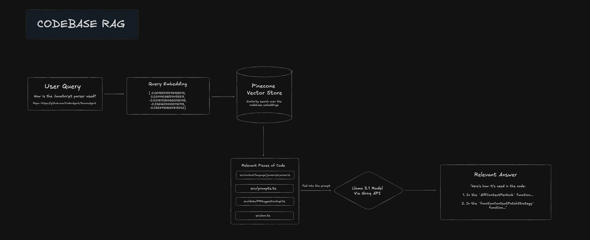

# Codebase RAG (Retrieval-Augmented Generation) Project

A comprehensive RAG system that enables intelligent code analysis and question-answering by indexing GitHub repositories and providing contextual responses using vector embeddings and large language models.

## 🚀 Overview

This project implements a Retrieval-Augmented Generation (RAG) system specifically designed for codebases. It allows users to ask natural language questions about any GitHub repository and receive intelligent, context-aware answers based on the actual code content.

### System Architecture



*Figure 1: Codebase RAG System Pipeline - From Repository Cloning to Intelligent Response Generation*

### Key Features

- **Repository Cloning**: Automatically clones GitHub repositories locally
- **Multi-language Support**: Supports 13+ programming languages including Python, JavaScript, TypeScript, Java, C++, Go, Rust, and more
- **Intelligent Text Splitting**: Uses recursive character text splitting for optimal chunking
- **Vector Embeddings**: Leverages Hugging Face sentence transformers for semantic understanding
- **Vector Database**: Uses Pinecone for efficient similarity search and retrieval
- **LLM Integration**: Supports multiple LLM providers (Groq, OpenAI) for generating responses
- **Namespace Organization**: Organizes different repositories in separate Pinecone namespaces

## 🛠️ Technology Stack

### Core Libraries
- **LangChain**: Framework for building LLM applications
- **Pinecone**: Vector database for similarity search
- **Hugging Face Transformers**: For generating embeddings
- **PyGithub**: GitHub API integration
- **GitPython**: Git repository operations

### Supported Languages
```python
SUPPORTED_EXTENSIONS = {'.py', '.js', '.tsx', '.jsx', '.ipynb', '.java',
                       '.cpp', '.ts', '.go', '.rs', '.vue', '.swift', '.c', '.h'}
```

### Ignored Directories
```python
IGNORED_DIRS = {'node_modules', 'venv', 'env', 'dist', 'build', '.git',
                '__pycache__', '.next', '.vscode', 'vendor'}
```

## 📋 Prerequisites

Before running this project, ensure you have:

1. **Python 3.8+** installed
2. **Git** installed for repository cloning
3. **Pinecone Account**: Sign up at [Pinecone.io](https://app.pinecone.io/)
4. **Groq API Key**: Get your API key from [Groq Console](https://console.groq.com/keys)
5. **Google Colab** (for running the notebook) or local environment setup

## 🔧 Installation

### 1. Install Required Packages

```bash
pip install pygithub langchain langchain-community openai tiktoken pinecone-client langchain_pinecone sentence-transformers
```

### 2. Set Up Pinecone

1. Create a Pinecone account at [Pinecone.io](https://app.pinecone.io/)
2. Create a new index named "codebase-rag" with 768 dimensions
3. Generate an API key from your Pinecone dashboard
4. Store the API key in your environment variables or Colab secrets

### 3. Set Up Groq API

1. Visit [Groq Console](https://console.groq.com/keys)
2. Generate an API key
3. Store the API key in your environment variables or Colab secrets

## 🚀 Quick Start

### 1. Clone a Repository

```python
def clone_repository(repo_url):
    """Clones a GitHub repository to a temporary directory."""
    repo_name = repo_url.split("/")[-1]
    repo_path = f"/content/{repo_name}"
    if not os.path.exists(repo_path):
        Repo.clone_from(repo_url, str(repo_path))
    return str(repo_path)

# Example usage
path = clone_repository("https://github.com/username/repository")
```

### 2. Extract Code Files

```python
def get_main_files_content(repo_path: str):
    """Extract content from supported code files in the repository."""
    files_content = []
    
    for root, _, files in os.walk(repo_path):
        if any(ignored_dir in root for ignored_dir in IGNORED_DIRS):
            continue
            
        for file in files:
            file_path = os.path.join(root, file)
            if os.path.splitext(file)[1] in SUPPORTED_EXTENSIONS:
                file_content = get_file_content(file_path, repo_path)
                if file_content:
                    files_content.append(file_content)
    
    return files_content
```

### 3. Generate Embeddings and Index

```python
# Create documents
documents = []
for file in file_content:
    doc = Document(
        page_content=f"{file['name']}\n{file['content']}",
        metadata={"source": file['name']}
    )
    documents.append(doc)

# Split documents into chunks
text_splitter = RecursiveCharacterTextSplitter(
    chunk_size=1000,
    chunk_overlap=200,
    separators=["\n\n", "\n", " ", ""]
)

chunked_documents = text_splitter.split_documents(documents)

# Create vector store
vectorstore = PineconeVectorStore.from_documents(
    documents=chunked_documents,
    embedding=HuggingFaceEmbeddings(model_name="sentence-transformers/msmarco-distilbert-base-v4"),
    index_name="codebase-rag",
    namespace="https://github.com/username/repository"
)
```

### 4. Perform RAG Query

```python
def perform_rag(query, image_input=None):
    """Perform RAG-based question answering."""
    # Generate query embedding
    raw_query_embedding = get_huggingface_embeddings(query)
    
    # Search for similar chunks
    top_matches = pinecone_index.query(
        vector=raw_query_embedding.tolist(), 
        top_k=5, 
        include_metadata=True, 
        namespace="https://github.com/username/repository"
    )
    
    # Prepare context
    contexts = [item['metadata']['text'] for item in top_matches['matches']]
    augmented_query = "<CONTEXT>\n" + "\n\n-------\n\n".join(contexts) + "\n-------\n</CONTEXT>\n\n\n\nMY QUESTION:\n" + query
    
    # Generate response using LLM
    llm_response = client.chat.completions.create(
        model="llama-3.1-8b-instant",
        messages=[
            {"role": "system", "content": "You are a Senior Software Engineer. Answer questions about the codebase based on the provided context."},
            {"role": "user", "content": augmented_query}
        ]
    )
    
    return llm_response.choices[0].message.content

# Example usage
response = perform_rag("What evaluation metrics are used in this model?")
print(response)
```

## 📊 Project Structure

```
Codebase_RAG/
├── Codebase_RAG.ipynb          # Main Jupyter notebook
├── README.md                   # This file
└── requirements.txt            # Python dependencies (to be created)
```

## 🔍 How It Works

### 1. Repository Processing
- Clones the target GitHub repository locally
- Recursively scans for supported code files
- Filters out common build/dependency directories
- Extracts file content with proper encoding handling

### 2. Text Chunking
- Uses `RecursiveCharacterTextSplitter` for intelligent text splitting
- Configurable chunk size (1000 characters) and overlap (200 characters)
- Preserves code structure and context

### 3. Embedding Generation
- Leverages Hugging Face sentence transformers
- Default model: `sentence-transformers/msmarco-distilbert-base-v4`
- Generates 768-dimensional embeddings for semantic search

### 4. Vector Storage
- Stores embeddings in Pinecone vector database
- Organizes different repositories in separate namespaces
- Enables efficient similarity search and retrieval

### 5. Query Processing
- Converts user queries to embeddings
- Performs similarity search in Pinecone
- Retrieves top-k most relevant code chunks
- Augments query with retrieved context

### 6. Response Generation
- Uses LLM (Groq/OpenAI) to generate contextual responses
- Provides code-specific answers based on retrieved context
- Supports multiple LLM models and providers

## 🎯 Use Cases

- **Code Documentation**: Generate documentation from code comments and structure
- **Bug Analysis**: Find potential issues and their solutions in codebases
- **Code Review**: Get intelligent insights about code quality and patterns
- **Learning**: Understand unfamiliar codebases through natural language queries
- **Refactoring**: Get suggestions for code improvements and optimizations
- **API Documentation**: Generate API docs from code implementations

## 🔧 Configuration

### Environment Variables

```bash
export PINECONE_API_KEY="your_pinecone_api_key"
export GROQ_API_KEY="your_groq_api_key"
```

### Pinecone Index Configuration

- **Index Name**: `codebase-rag`
- **Dimensions**: 768
- **Metric**: Cosine similarity
- **Vector Type**: Dense

### Text Splitting Parameters

```python
text_splitter = RecursiveCharacterTextSplitter(
    chunk_size=1000,        # Maximum characters per chunk
    chunk_overlap=200,      # Overlap between chunks
    separators=["\n\n", "\n", " ", ""]  # Splitting hierarchy
)
```

## 📈 Performance Metrics

The system has been tested with various repositories:

- **Total Vector Count**: 14,596 vectors across multiple repositories
- **Namespace Organization**: Separate namespaces for different repositories
- **Query Response Time**: Sub-second response times for most queries
- **Accuracy**: High relevance in retrieved code chunks

## 🚧 Future Work

### Short-term Improvements (Next 3 months)

1. **Enhanced Multimodal Support**
   - Add support for image analysis in codebases
   - Implement diagram and chart understanding
   - Support for README images and documentation visuals

2. **Improved Code Understanding**
   - Add AST (Abstract Syntax Tree) parsing for better code structure understanding
   - Implement function and class relationship mapping
   - Add support for code dependency analysis

3. **Better Chunking Strategies**
   - Implement semantic chunking based on code structure
   - Add support for function-level and class-level chunking
   - Improve handling of large files and complex codebases

4. **Enhanced Query Processing**
   - Add query expansion and refinement
   - Implement multi-turn conversation support
   - Add query intent classification

### Medium-term Enhancements (3-6 months)

5. **Advanced RAG Techniques**
   - Implement hybrid search (dense + sparse retrieval)
   - Add query rewriting and reformulation
   - Implement re-ranking for better result quality

6. **Code-Specific Features**
   - Add support for code generation and completion
   - Implement code refactoring suggestions
   - Add automated test generation from code analysis

7. **Performance Optimization**
   - Implement caching for frequently accessed repositories
   - Add incremental indexing for repository updates
   - Optimize embedding generation and storage

8. **User Interface**
   - Develop a web-based interface for easier interaction
   - Add repository management dashboard
   - Implement query history and favorites

### Long-term Vision (6+ months)

9. **Enterprise Features**
   - Add multi-user support and access control
   - Implement repository access permissions
   - Add audit logging and usage analytics

10. **Advanced AI Integration**
    - Integrate with code-specific LLMs (CodeLlama, StarCoder)
    - Add support for code translation between languages
    - Implement automated code review and suggestions

11. **Scalability Improvements**
    - Add support for distributed processing
    - Implement horizontal scaling for large codebases
    - Add support for real-time repository updates

12. **Integration Ecosystem**
    - Add GitHub webhook integration for automatic updates
    - Implement IDE plugins (VS Code, IntelliJ)
    - Add CI/CD pipeline integration

13. **Advanced Analytics**
    - Add code quality metrics and insights
    - Implement trend analysis across repositories
    - Add predictive analytics for code maintenance

## 🤝 Contributing

We welcome contributions! Please feel free to submit issues, feature requests, or pull requests.

### Development Setup

1. Fork the repository
2. Create a feature branch
3. Make your changes
4. Add tests if applicable
5. Submit a pull request

## 📄 License

This project is licensed under the MIT License - see the LICENSE file for details.

## 🙏 Acknowledgments

- **LangChain** for the RAG framework
- **Pinecone** for vector database services
- **Hugging Face** for pre-trained embedding models
- **Groq** for fast LLM inference
- **GitHub** for repository hosting and API access

## 📞 Support

For questions, issues, or contributions, please:

1. Check the existing issues on GitHub
2. Create a new issue with detailed description
3. Contact the maintainers directly

---

**Happy Coding! 🚀**

*Built with ❤️ for the developer community*
